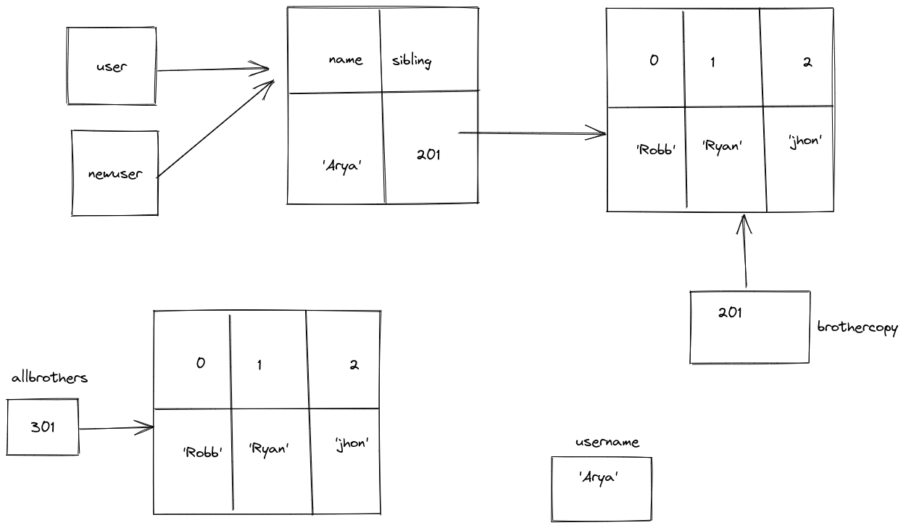

```js
let user = {
  name: "Arya",
  sibling: ["Robb", "Ryan", "John"],
};
let allBrothers = ["Robb", "Ryan", "John"];
let brothersCopy = user.sibling;
let usename = user.name;
let newUser = user;
```

1. Memory representation

- Create the memory representation of the above snippet on notebook.
- Take a photo/screenshot and add it to the folder `code`

<!-- To add this image here use  -->



2. Answer the following with reason:

- `user == newUser;` // output = true, reason = they are both pointing to same memory location.
- `user === newUser;` // output = true, reason = they both contain the same data type which is object.
- `user.name === newUser.name;` // output = true, reason = they both contain the same data type which is string.
- `user.name == newUser.name;` // output = true, reason = they both contain the same value.
- `user.sibling == newUser.sibling;` // output = true, reason = they both contain the same value.
- `user.sibling === newUser.sibling;` // output = true, reason = they both contain the same data type which is array.
- `user.sibling == allBrothers;` // output = false, reason = they both contain different memory address.
- `user.sibling === allBrothers;` // output = false, reason = they both contain different memory address.
- `brothersCopy === allBrothers;` // output = false, reason = they both contain different memory address.
- `brothersCopy == allBrothers;` // output = false, reason = they both contain different memory address.
- `brothersCopy == user.sibling;` // output = true, reason = they are both pointing to same memory location.
- `brothersCopy === user.sibling;` // output = true, reason = they are both pointing to same memory location.
- `brothersCopy[0] === user.sibling[0];` // output = true, reason = they both contain the same value and data type is also same.
- `brothersCopy[1] === user.sibling[1];` // output = true, reason = they both contain the same value and data type is also same.
- `user.sibling[1] === newUser.sibling[1];` // output = true, reason = they both contain the same value and data type is also same.
