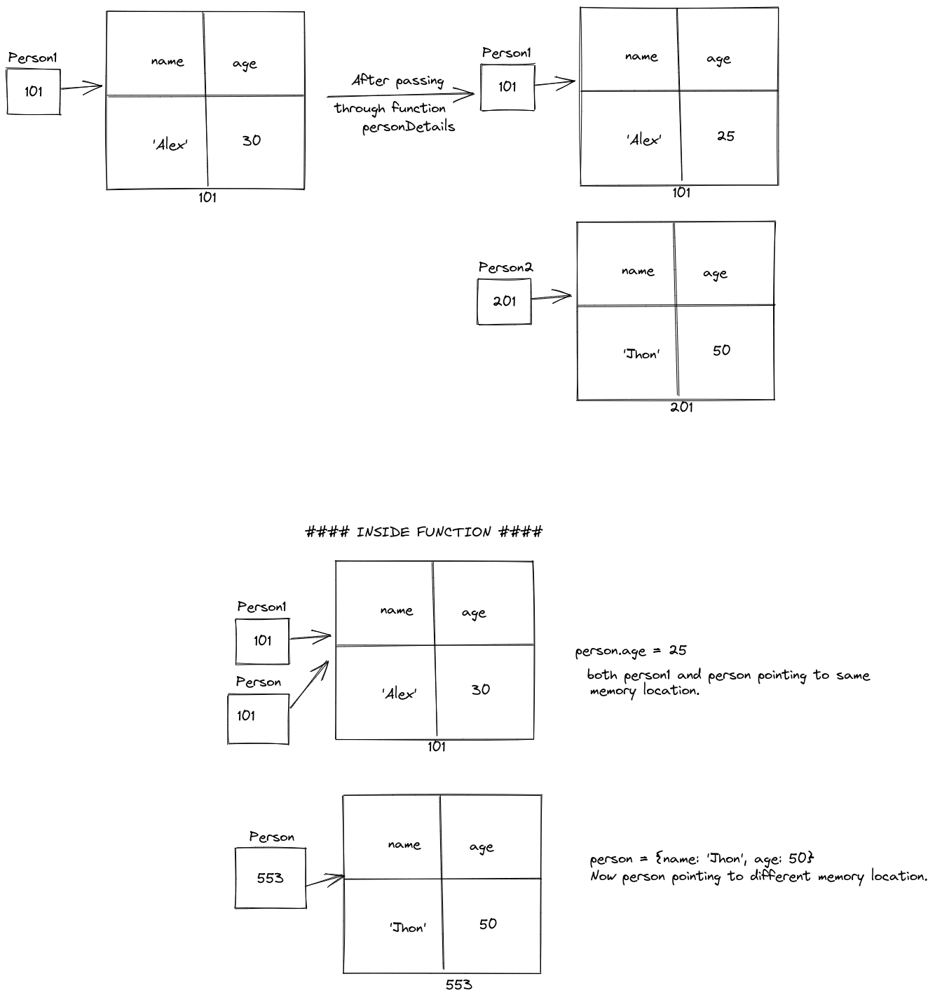

1. What will be the output and explain the reason.

```js
let obj = { name: "Arya" };
obj = { surname: "Stark" };
let newObj = { name: "Arya" };
let user = obj;
let arr = ["Hi"];
let arr2 = arr;
```

Answer the following with reason after going through the above code:

- `[10] === [10]` // output = false, reason = different memory location.
- What is the value of obj? // answer
- `obj == newObj` // output = false, reason = different memory location.
- `obj === newObj` // output = false, reason = different memory location.
- `user === newObj` // output = false, reason = different memory location.
- `user == newObj` // output = false, reason = different memory location.
- `user == obj` // output = true, reason = they are pointing to same memory location.
- `arr == arr2` // output = true, reason = they are pointing to same memory location.
- `arr === arr2` // output = true, reason = they are pointing to same memory location.

2. What's will be the value of `person1` and `person2` ? Explain with reason. Draw the memory representation diagram.

- person1 = { "name": "Alex", "age": 25 }
- person2 = { "name": "Jhon", "age": 50 }



<!-- To add this image here use  -->

```js
function personDetails(person) {
  person.age = 25;
  person = { name: "John", age: 50 };
  return person;
}
var person1 = { name: "Alex", age: 30 };
var person2 = personDetails(person1);
console.log(person1);
console.log(person2);
```

3. What will be the output of the below code:

```js
var brothers = ["Bran", "John"];
var user = {
  name: "Sansa",
};
user.brothers = brothers;
brothers.push("Robb");
console.log(user.brothers === brothers); // true reason = pointing to same memory location.
console.log(user.brothers.length === brothers.length); // true reason = pointing to same memory location.
```
